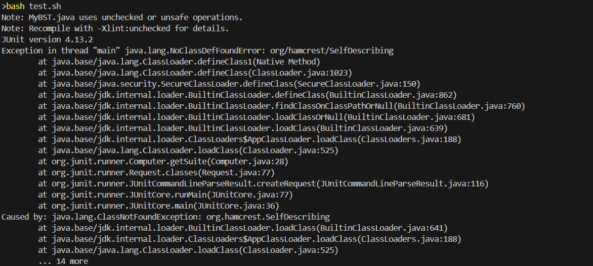
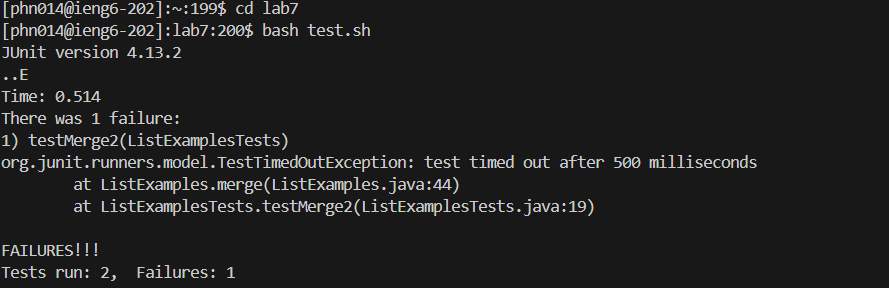

# Lab 5 Putting it All Together

## Piazza Post

#### Student Post:
I was checking my BST implementation and when compiling and running my tests via a bash script I get the following warning and error. I'm not sure what the exception is since I passed javac with -cp and the classpath. Also for the warning on unsafe operations, I looked into it online and I think its because I use generics in my implmentation but I'm not sure where the issue is since the output doesn't give a line number error anywhere. I attached a screenshot below showing the error. 


#### TA Response:
For the exception make sure you pass in the correct filepath for both hamcrest and junit for the javac command. Also the unsafe/unchecked operations are usually caused by either creating something like an ArrayList without a type or casting an object to a generic type without checking first.

#### Student Response:
I was able to fix the exception by changing the classpath. I copied the classpath from an old assignment but it used a different version of hamcrest so the filepath was incorrect. I was also able to get rid of the warning by changing an unchecked generic type cast to use wildcards to check before casting the object. I attached a screenshot and other information incase anyone else encounters a similar error.

File Structure:
home
 - libs
     - hamcrest-2.2.jar
     - junit-4.13.2.jar
 - MyBST.java
 - MyBST.class
 - CustomTester.java
 - CustomTester.class
 - test.sh
 - MyBST$MyBSTNode.class

Test.sh File content

**Before**
```
javac -cp ".;libs\hamcrest-1.3.jar;libs/junit-4.13.2.jar" *.java
java -cp ".;libs\hamcrest-1.3.jar;libs/junit-4.13.2.jar" org.junit.runner.JUnitCore CustomTester
```
**After**
```
javac -cp ".;libs\hamcrest-2.2.jar;libs/junit-4.13.2.jar" *.java
java -cp ".;libs\hamcrest-2.2.jar;libs/junit-4.13.2.jar" org.junit.runner.JUnitCore CustomTester
```

MyBST.java content
I only included the code part I changed since the whole file is over 200 lines long
**Before**
```
public boolean equals(Object obj) {
            if (!(obj instanceof MyBSTNode))
                return false;

            MyBSTNode<K, V> comp = (MyBSTNode<K, V>) obj;

            return ((this.getKey() == null ? comp.getKey() == null :
                    this.getKey().equals(comp.getKey()))
                    && (this.getValue() == null ? comp.getValue() == null :
                    this.getValue().equals(comp.getValue())));
}
```
**After**
```
public boolean equals(Object obj) {
            if (!(obj instanceof MyBSTNode))
                return false;

            MyBSTNode<?, ?> comp = (MyBSTNode<?, ?>) obj;

            return ((this.getKey() == null ? comp.getKey() == null :
                    this.getKey().equals(comp.getKey()))
                    && (this.getValue() == null ? comp.getValue() == null :
                    this.getValue().equals(comp.getValue())));
}
```

Screenshot of the otuput:


To run the code I just ran ```bash test.sh``` in terminal.

## Reflection

Soemthing cool that I learned in the past few weeks was that I can execute commands in terminal in Java. While I know that it isn't always economical to do so I found it interesting that you can do so. 

<div style="page-break-after: always"></div>

# Lab 4 Vim

## Background and Code

For this lab we used vim along with various other commands and shortcuts to work on completing a task as efficiently as possible.

#### Command 1:


Keys Pressed: ```ssh <space> phn014@ieng6.ucsd.edu```

The ssh command allows me to log into a remote computer and I specifically logged into my account on the ieng6.ucsd.edu server. 

#### Command 2


Keys Pressed: ```git <space> clone <space> <Control> v```

The git clone command allows me to clone a repository on github to my local machine. I had already copied the github ssh link (git@github.com:PierceNguyen/lab7.git) before so it was in my clipboard and I could paste the link with ```<control> v```. 

#### Command 3


Keys Pressed: ```cd <space> lab7 <Enter> bash <space> test.sh <Enter>```

Since I was outside the lab7 directory I entered it with the cd command. Then once inside I ran the tests by using bash to run the test.sh file which would compile the java files and then run the test java file. A test failing indicates a faulty implementation of the function. 

#### Command 4


Keys Pressed: ```vim <space> List <Tab> .java <Enter> :44 <Enter> e r 2 <ESC> :wq <Enter> ```

Using vim then the filename allows me to open the java file in vim. I used ```<Tab>``` to autocomplete the file name. Once inside vim using ```:44``` allows me to go to the 44th line where the fix I need to make is located. Then ```e r 2``` allows me to jump to the end of the word and replace the last letter of the word with 2. Then using ```:wq``` allows me to exit and save the file. 

#### Command 5


Keys Pressed: ```bash <space> test.sh <Enter>```

I ran the tests by using bash to run the test.sh file which would compile the java files and then run the test java file. The output indicates that with the function now fixed, it can pass all the tests.

#### Command 6


Keys Pressed: ```git <space> add <space> . <Enter> git <space> commit <space> -m <space> "fixed <space> bug" <Enter> git <space> push <Enter>```

Using ```git add .``` adds all files with changes to the next git commit. Then ```git commit -m "fixed bug"``` creates a git commit with the commit message of "fixed bug". Finally ```git push``` pushes these changes to Github. 

<div style="page-break-after: always"></div>

# Lab 3 Bugs and Commands

## Background and Code

For this lab we looked at a buggy program and created tests for various functions in the program and fixed some of the functions. 

## Part 1: Bugs

Here I wrote a JUnit test for the reverseInPlace function where the test is meant to fail due to the reverseInPlace function being buggy/incorrect. 
```
//Code that is tested
  static void reverseInPlace(int[] arr) {
    for(int i = 0; i < arr.length; i += 1) {
      arr[i] = arr[arr.length - i - 1];
    }
  }

//Code from Testing java file
@Test 
	public void CustomtestReverseInPlaceWrong() {
    int[] input1 = {1,2,3};
    ArrayExamples.reverseInPlace(input1);
    assertArrayEquals(new int[]{3,2,1}, input1);
	}
```

Here I wrote a JUnit test for the reverseInPlace function where the test is meant to pass despite the reverseInPlace function being buggy/incorrect. 
```
//Code that is tested
  static void reverseInPlace(int[] arr) {
    for(int i = 0; i < arr.length; i += 1) {
      arr[i] = arr[arr.length - i - 1];
    }
  }

//Code from Testing java file
@Test 
	public void CustomtestReverseInPlaceRight() {
    int[] input1 = {1,2,3,2,1};
    ArrayExamples.reverseInPlace(input1);
    assertArrayEquals(new int[]{1,2,3,2,1}, input1);
	}
```

Here is the output from running both JUnit tests with the 2nd test passing and the first test failing. 
```
$ bash test.sh
JUnit version 4.13.2
..E
Time: 0.015
There was 1 failure:
1) CustomtestReverseInPlaceWrong(ArrayTests)
arrays first differed at element [2]; expected:<1> but was:<3>
        at org.junit.internal.ComparisonCriteria.arrayEquals(ComparisonCriteria.java:78)
        at org.junit.internal.ComparisonCriteria.arrayEquals(ComparisonCriteria.java:28)
        at org.junit.Assert.internalArrayEquals(Assert.java:534)
        at org.junit.Assert.assertArrayEquals(Assert.java:418)
        at org.junit.Assert.assertArrayEquals(Assert.java:429)
        at ArrayTests.CustomtestReverseInPlaceWrong(ArrayTests.java:24)
        ... 30 trimmed
Caused by: java.lang.AssertionError: expected:<1> but was:<3>
        at org.junit.Assert.fail(Assert.java:89)
        at org.junit.Assert.failNotEquals(Assert.java:835)
        at org.junit.Assert.assertEquals(Assert.java:120)
        at org.junit.Assert.assertEquals(Assert.java:146)
        at org.junit.internal.ExactComparisonCriteria.assertElementsEqual(ExactComparisonCriteria.java:8)
        at org.junit.internal.ComparisonCriteria.arrayEquals(ComparisonCriteria.java:76)
        ... 36 more

FAILURES!!!
Tests run: 2,  Failures: 1
```

Now that we see our function failing some tests, lets fix the function so it works as intended. 
```
  //buggy function
  static void reverseInPlace(int[] arr) {
    for(int i = 0; i < arr.length; i += 1) {
      arr[i] = arr[arr.length - i - 1];
    }
  }
```
```
  //fixed function
  static void reverseInPlace(int[] arr) {
    for(int i = 0; i < arr.length / 2; i += 1) {
      int temp = arr[i];
      arr[i] = arr[arr.length - i - 1];
      arr[arr.length - i - 1] = temp;
    }
  }
```

The original function was wrong since it would overwrite the first half the the array with the 2nd half effectively mirroring the array
around the midpoint. To fix this I just swapped the outer array elements and worked my way to the middle to ensure that none of the array
elements were overwritten before they were swapped. With this fix the function should be able to reverse arrays correctly now. 

## Part 2 - Researching Commands

Now lets explore the grep command in more detail and explore some of the command-line options we can pass to these commands. 

#### grep -i
Using the grep -i command allows grep to ignore case. Using this on a file would give the following result. It displays all the lines that match the string "portland" disregarding case. 
```
\docsearch\technical> grep -i "portland" ./911report/chapter-1.txt
    For those heading to an airport, weather conditions could not have been better for a safe and pleasant journey. Among the travelers were Mohamed Atta and Abdul Aziz al Omari, who arrived at the airport in Portland, Maine.
    Boston: American 11 and United 175. Atta and Omari boarded a 6:00 A.M. flight from Portland to Boston's Logan International Airport.
    While Atta had been selected by CAPPS in Portland, three members of his hijacking team-Suqami, Wail al Shehri, and Waleed al Shehri-were selected in Boston. Their selection affected only the handling of their checked bags, not their screening at the checkpoint. All five men cleared the checkpoint and made their way to the gate for American 11. Atta, Omari, and Suqami took their seats in business class (seats 8D, 8G, and 10B, respectively). The Shehri brothers had adjacent seats in row 2 (Wail in 2A, Waleed in 2B), in the firstclass cabin. They boarded American 11 between 7:31 and 7:40. The aircraft pushed back from the gate at 7:40.
```
Using the grep -i command on a directory as shown below throws an error stating it doesn't take a directory as is.
```
docsearch\technical> grep -i "portland" ./911report/             
/usr/bin/grep: ./911report/: Is a directory
```

#### grep -v
Using the grep -v command allows you to look for lines that do not have the provided string. Using it on a file is shown below. I shortened it since the output was extremely long but all of the lines grep output do not contain the word "the". 
```
docsearch\technical> grep -v "the" ./911report/preface.txt


            PREFACE
                Democrats chosen by elected leaders from our nation's capital at a time of great
                avoid such tragedy again?
                27, 2002).
            Our mandate was sweeping. The law directed us to investigate "facts and circumstances
                to intelligence agencies, law enforcement agencies, diplomacy, immigration issues
                reviewed more than 2.5 million pages of documents and interviewed more than 1,200
...
```
Using the grep -v command on a directory as shown below throws an error stating it doesn't take a directory as is.
```
docsearch\technical> grep -v "the" .\plos\                        
/usr/bin/grep: .\plos\: Is a directory
```

#### grep -n
Using the grep -n command allows you to look for line number of lines with matching strings. We can see this below where using it on a file returns the line number of the line with the matching word along with the line itself. 
```
docsearch\technical> grep -n "richer" .\plos\journal.pbio.0020001.txt
29:        It is rather obvious that richer countries are able to invest more resources in science
```
Using the grep -n command on a directory as shown below throws an error stating it doesn't take a directory as is.
```
docsearch\technical> grep -n "richer" .\plos\
/usr/bin/grep: .\plos\: Is a directory
```

#### grep -w
Using the grep -w command allows you to look for only the exact matching string in a file instead of any word containing the word. We can see this below where using it on a file returns the lines with an exact matching word. 
```
docsearch\technical> grep -w "clearly" .\plos\journal.pbio.0020001.txt    
        (SCI). North America and Europe clearly dominate the number of scientific publications
            North America and Europe clearly dominate the number of scientific
```
Using the grep -w command on a directory as shown below throws an error stating it doesn't take a directory as is.
```
docsearch\technical> grep -w "clearly" .\plos\                            
/usr/bin/grep: .\plos\: Is a directory
```

For the various grep commands I referenced https://www.freecodecamp.org/news/grep-command-in-linux-usage-options-and-syntax-examples/ for basic information on how the commands worked. 
<div style="page-break-after: always"></div>

# Lab 2 Servers and SSH Keys

## Background and Code

For this lab we created a chat server which has a message board where various users can post messages to the board. The code for the server is below:

```
import java.io.IOException;
import java.net.URI;
import java.util.ArrayList;

class Handler implements URLHandler {
    // The one bit of state on the server: a number that will be manipulated by
    // various requests.
    ArrayList<String> messageBoard = new ArrayList<String>();
    public String handleRequest(URI url) {
        if (url.getPath().equals("/")) {
            String returnString = new String();
            for(int i = 0; i < messageBoard.size();i++){
                returnString = returnString + messageBoard.get(i);
            }
            return String.format("Message Board:\n\n"+ returnString);
        }
        else {
            if (url.getPath().contains("/add-message")) {
                String[] parameters = url.getQuery().split("&");
                String[] message = parameters[0].split("=");
                String[] user = parameters[1].split("=");
                messageBoard.add(user[1] + ": " + message[1] + "\n");
                String returnString = new String();
                for(int i = 0; i < messageBoard.size();i++){
                    returnString = returnString + messageBoard.get(i);
                }
                return String.format("Message Board:\n\n"+ returnString);
            }
            return "404 Not Found!";
        }
    }
}

class ChatServer {
    public static void main(String[] args) throws IOException {
        if(args.length == 0){
            System.out.println("Missing port number! Try any number between 1024 to 49151");
            return;
        }
        int port = Integer.parseInt(args[0]);
        Server.start(port, new Handler());
    }
}
```
## Demonstration of ChatServer
First message being sent:


When going to this url the method handleRequest is called with the url: http://localhost:4000/add-message?s=Hello&user=jpolitz as its parameter. Since the path is /add-message after the host, the else statement gets called which then changes the class variable messageBoard to now include a new string with the format: user: message or in this case jpolitz: Hello. Then the entire Arraylist<String> is printed to the website. The only class variable that changes is the messageBoard variable. 

Second message being sent:


When going to this url the method handleRequest is called with the url: http://localhost:4000/add-message?s=How%20are%20you&user=yash as its parameter. Since the path is /add-message after the host, the else statement gets called which then changes the class variable messageBoard to now include a new string with the format: user: message or in this case yash: How are you. Then the entire Arraylist<String> is printed to the website. The only class variable that changes is the messageBoard variable. 

## Part 2
```
pninv@PHN-Evo MINGW64 /c/users/pninv/.ssh
$ ls /c/users/pninv/.ssh/id_ed25519.pub
/c/users/pninv/.ssh/id_ed25519.pub
```
Here we use ls to see the absolute path of the public key and can see that our public key ends with a .pub. Additionally we can see that our keys absolute path is: /c/Users/pninv/.ssh/id_ed25519.pub. 
```
pninv@PHN-Evo MINGW64 /c/users/pninv/.ssh
$ ssh phn014@ieng6.ucsd.edu
Last login: Tue Apr 16 11:10:45 2024 from 100.81.38.16
Hello phn014, you are currently logged into ieng6-203.ucsd.edu
```
After transferring the key to our remote server we are able to login without entering our password.
```
[phn014@ieng6-203]:.ssh:78$ ls /home/linux/ieng6/oce/4m/phn014/.ssh/authorized_keys
/home/linux/ieng6/oce/4m/phn014/.ssh/authorized_keys
```
Here we use ls to see the absolute path of the authorized keys. Additionally we can see that our keys absolute path is: /home/linux/ieng6/oce/4m/phn014/.ssh/authorized_keys. 

In our week 2 and 3 labs I learned how to connect into remote servers using ssh. I also learned how to generate public and private keys to authenticate my computer so I didn't need to type in my password every time I logged on to the server. 

<div style="page-break-after: always"></div>

# Lab 1 Remote Access and FileSystem

This week in CSE15L we learned various terminal commands such as ``cd``, ``ls`` and ``cat``. This lab report outlines the three commands and various arguments that can be passed for them below. 

## Command: cd

**Using cd with no arguments**

With the root directory as the working directory:
```
[user@sahara /]$ cd 
[user@sahara /]$ 
```
Outside the root directory:
```
[user@sahara ~/lecture1]$ cd 
[user@sahara ~]$ 
```
As shown above, using cd with no arguments does not result in an error but also does not output anything. If you use cd in the root directory the current directory does not change; however, if you use it outside the root directory it changes the working directory to be one layer up.


**Using cd with a directory as an argument**
With the root directory as the working directory:
```
[user@sahara /]$ cd /home/lecture1
[user@sahara ~/lecture1]$ 
```
Here we can see that despite cd not outputting anything there was no error either. Originally, we were in the root directory however upon passing a valid directory we were able to change our working directory to be the lecture1 folder. 


**Using cd with a file as an argument**
With /home/lecture1 as the working directory:
```
[user@sahara ~/lecture1]$ cd Hello.java
bash: cd: Hello.java: Not a directory
[user@sahara ~/lecture1]$
```
Here we can see that cd did output something this time and it is an error. This is an error since cd can only be used to change your current working directory and cannot be used to open files. 


## Command: ls

**Using ls with no arguments**
With /home/lecture1 as the working directory:
```
[user@sahara ~/lecture1]$ ls
Hello.class  Hello.java  messages  README
[user@sahara ~/lecture1]$
```
As shown above, using ls with no arguments does not result in an error and prints a list of all the files and folders in the working directory to terminal.


**Using ls with a directory as an argument**
With /home/lecture1 as the working directory
```
[user@sahara ~/lecture1]$ ls messages
en-us.txt  es-mx.txt  vi.txt  zh-cn.txt
[user@sahara ~/lecture1]$
```
Using ls with a directory as an argument prints a list of all the files and folders in the specified directory to terminal and is not an error.


**Using ls with a file as an argument**
With /home/lecture1 as the working directory
```
[user@sahara ~/lecture1]$ ls Hello.java
Hello.java
[user@sahara ~/lecture1]$
```
Using ls with a file as an argument does not throw an error and prints out the name of the given file. 

## Command: cat

**Using cat with no arguments**
With /home/lecture1 as the working directory
```
[user@sahara ~/lecture1]$ cat
prints out what i type
prints out what i type
^C
[user@sahara ~/lecture1]$
```
If no arguments are given cat does not throw an error but simply copies what you write in terminal and prints it out in terminal. To get back to the command line you need to hit control + c.


**Using cat with a directory as an argument**
With /home/lecture1 as the working directory
```
[user@sahara ~/lecture1]$ cat messages
cat: messages: Is a directory
[user@sahara ~/lecture1]$
```
Using cat with a directory as an argument throws an error which states that the argument is a directory which implies that directories cannot be used as an argument for cat.


**Using cat with a file as an argument**
With /home/lecture1 as the working directory

With one valid file given:
```
[user@sahara ~/lecture1]$ cat README
To use this program:

javac Hello.java
java Hello messages/en-us.txt
[user@sahara ~/lecture1]$
```

With more than one valid file given:
```
[user@sahara ~/lecture1]$ cat README Hello.java
To use this program:

javac Hello.java
java Hello messages/en-us.txt
import java.io.IOException;
import java.nio.charset.StandardCharsets;
import java.nio.file.Files;
import java.nio.file.Path;

public class Hello {
  public static void main(String[] args) throws IOException {
    String content = Files.readString(Path.of(args[0]), StandardCharsets.UTF_8);    
    System.out.println(content);
  }
}[user@sahara ~/lecture1]$ 
```
Here we can see that using files as arguments for the cat command does not result in an error. Instead the cat command prints the contents of all the given files to terminal. 
